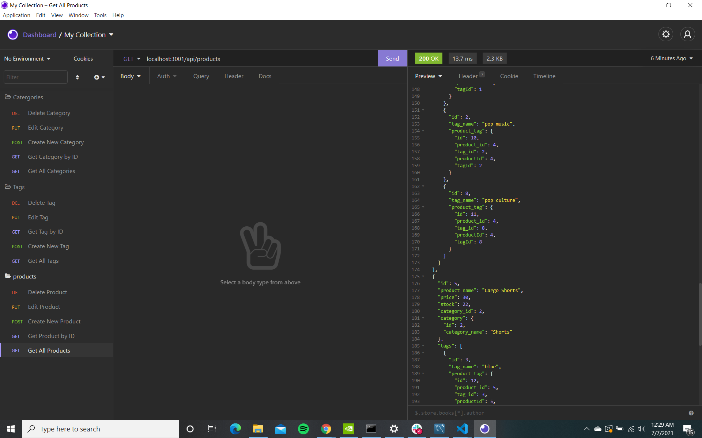
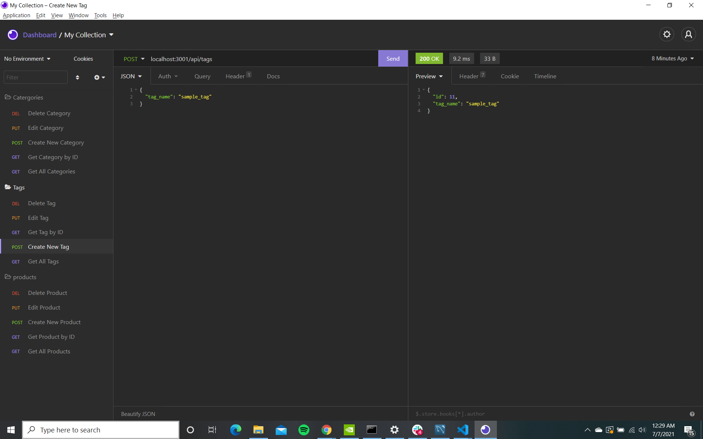

# E-Commerce-App

    Create an e-commerce back end. You will be given a working Express.js API that you will have to configure using Sequelize. Once finished, you should be able to connect to the database, and you should have functioning CRUD commands.

# User Story

    AS A manager at an internet retail company
    I WANT a back end for my e-commerce website that uses the latest technologies
    SO THAT my company can compete with other e-commerce companies
### Usage
  
  In order to use this app, you will need to use:

  * node.JS
  * Express
  * MySQL2
  * Squelize
  * Insomnia

### Installation
After copying the ssh/https link open your terminal(MacOS) or Gitbash(Windows) and enter the command git clone "paste the link here"

    Then in your code editor of choice open the intergrated terminal and run the following commands to get the app running;

        npm i , node run seed,  followed by node server.js

  
### Demo recording Link
[Video link for Demo](https://drive.google.com/file/d/1OFKogV9dfytKXB0I5NFSA6kqZSd4ekZr/view?usp=sharing)

### Deployment

Use the following gitHub link [E-Commerce backend App Repo](https://github.com/Luis0624/e-commerce-app) to get to my github page and be able to clone the repo for this project.

Demo image for cloning github repo

[Github Project Repo for the E-Commerce-App](https://github.com/Luis0624/e-commerce-app)

Sample Images of working App

### USAGE
After copying the ssh/https link open your terminal(MacOS) or Gitbash(Windows) and enter the command git clone "paste the link here"
Using VS code, or your choice of editor feel free to look through the HTML file,the CSS stylesheet and JS script. Contributions are welcome if they conform to the the following requirements:

* Refactoring suggestions can be made within comments above the code lines in question.
* Important: Use the Scout Rule, which recommends that you always leave the code a little cleaner than when you found it.
* If any code is changed please add a comment stating what was changed above the changed code.

### LICENSE
 MIT License

Copyright (c) 2021 Luis0624

Permission is hereby granted, free of charge, to any person obtaining a copy
of this software and associated documentation files (the "Software"), to deal
in the Software without restriction, including without limitation the rights
to use, copy, modify, merge, publish, distribute, sublicense, and/or sell
copies of the Software, and to permit persons to whom the Software is
furnished to do so, subject to the following conditions:

The above copyright notice and this permission notice shall be included in all
copies or substantial portions of the Software.

THE SOFTWARE IS PROVIDED "AS IS", WITHOUT WARRANTY OF ANY KIND, EXPRESS OR
IMPLIED, INCLUDING BUT NOT LIMITED TO THE WARRANTIES OF MERCHANTABILITY,
FITNESS FOR A PARTICULAR PURPOSE AND NONINFRINGEMENT. IN NO EVENT SHALL THE
AUTHORS OR COPYRIGHT HOLDERS BE LIABLE FOR ANY CLAIM, DAMAGES OR OTHER
LIABILITY, WHETHER IN AN ACTION OF CONTRACT, TORT OR OTHERWISE, ARISING FROM,
OUT OF OR IN CONNECTION WITH THE SOFTWARE OR THE USE OR OTHER DEALINGS IN THE
SOFTWARE.

